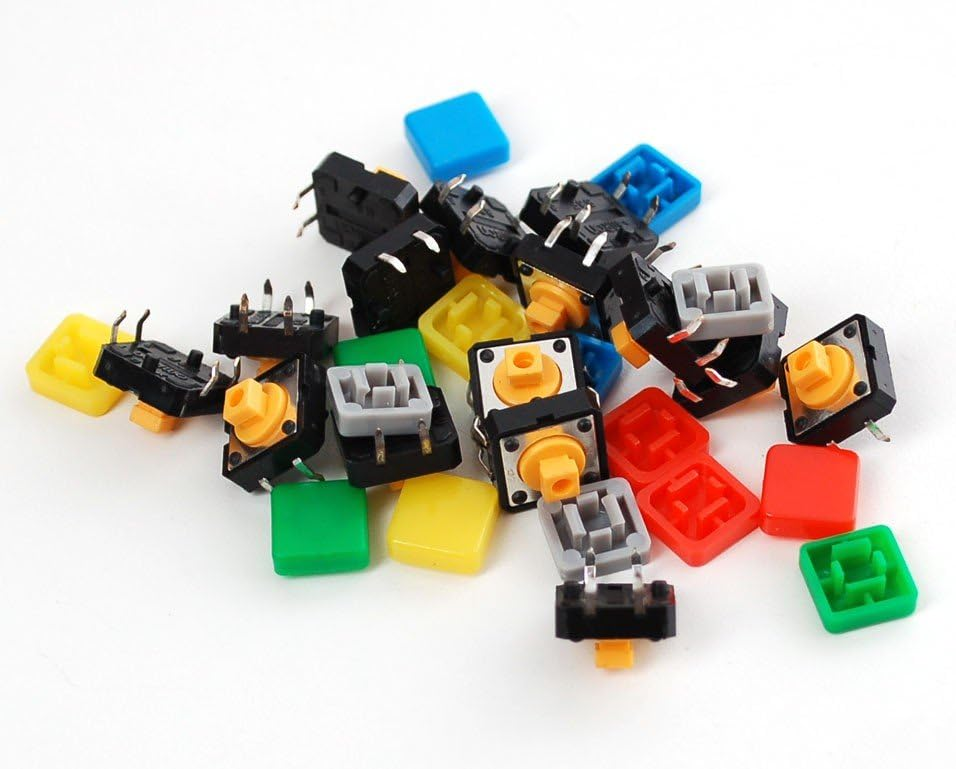
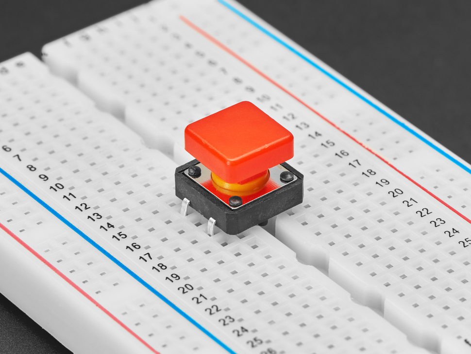
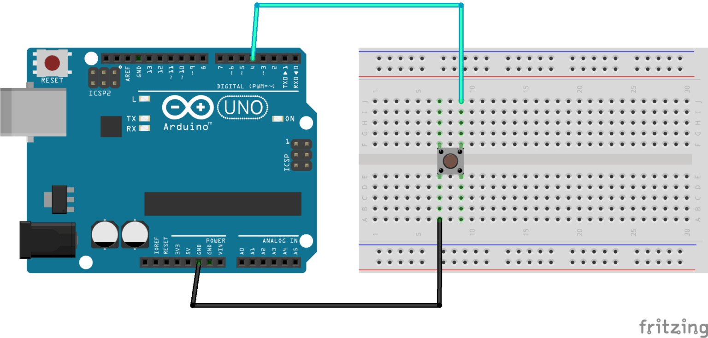
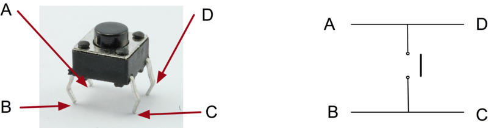

# Taster/Knopf

## Beschreibung

Taster oder auch Knöpfe sind eine sehr einfache Eingabemöglichkeit für Elektronik-Projekte und funktionieren ähnlich wie man es zuhause von Knöpfen von der Waschmaschine oder dem Geschirrspüler kennt. Dahinter verbirgt sich nichts Kompliziertes: Der Taster stellt eine elektrische Verbindung her, Strom fließt und der Computer (Arduino in unserem Fall) merkt, dass etwas passiert ist.

Diese Taster brauchen ein paar Kabel und einen Widerstand, damit sie benutzt werden können. Schneller geht es mit dem [Taster/Knopf (Platine)](/mks-welcome/part/mks-SeeedStudio-Grove_Button), den man direkt per Grove-Kabel anschließen kann.

@[youtube](https://www.youtube.com/watch?v=ITsk6dPSsqA)

## Aufbau 

Um diesen Taster zu nutzen, braucht es noch:
- Ein Breadboard
- Zwei Jumperkabel (male/male)

So bekommt man ihn zum Laufen: 

1. Stecke den Taster so auf das Breadboard:  

1. Verbinde die beiden Kabel mit dem Taster und den Arduino wie auf diesem Diagramm. Achte darauf die Pins `GND` und `4` zu nutzen. Achte dabei darauf, dass die Beine diagonal gegenüber angeschlossen werden. Mehr dazu unten. 

1. Füge dann den Code von unten ein. Mit dem Code kannst du testen, ob der Schalter funktioniert und der Arduino ihn erkennt. 
1. Öffne den **Serial Monitor** auf dem Laptop. Gehe dazu unter `Werkzeuge` oben im Menü und klicke auf `Serieller Monitor`. Dann wird unten sich ein Bereich öffnen, in dem mal sehen kann ob der Schalter erkannt wird.

### Schaltdiagramm des Tasters

Der Taster ist so wie im Bild aufgebaut. Wenn man also zwei Beine gegenüber anschließt, fließt der Strom einfach durch den Taster hindurch ohne geschalten zu werden. Um etwas zu schalten gehen also nur diagonale Verbindungen (A <-> C oder B <-> D), oder U-Verbindungen (A <-> B und C <-> D).

### Eigentlich braucht es einen Widerstand

Wenn man den Taster drückt, wird ein Kreislauf geschlossen und Strom fließt durch das Kabel. Wenn der Strom ungebremst oder unverbraucht durch den Taster wieder in den Arduino fließt, kann es einen Kurzschluss geben und den Arduino beschädigen. Daher braucht es eigentlich einen Widerstand, welcher den Strom abbremst. 

Der Arduino ist allerdings gut ausgerüstet und hat eingebaute Widerstände, welche man per Code aktivieren kann. Sobald man den digitalen Pin als `INPUT_PULLUP` registriert (im Gegensatz zum normalen `INPUT`), wird ein Widerstand dazwischengeschalten und der Arduino abgesichert.

## Beispiele

!!!show-examples:./examples/

<!-- infolist -->

## Weitere Informationen

- [Taster/Knopf (Platine)](/mks-welcome/part/mks-SeeedStudio-Grove_Button)
- [Adafruit Button-Sortiment](https://www.adafruit.com/product/1010)

## Projektbeispiele:

- [Funduino - Taster Tutorial](https://funduino.de/nr-5-taster-am-arduino)

## Hintergrundinformationen:

- [GPIO - Wikipedia Artikel](https://de.wikipedia.org/wiki/Allzweckeingabe/-ausgabe)
- [Steckplatine (Breadboard) - Wikipedia Artikel](https://de.wikipedia.org/wiki/Steckplatine)
