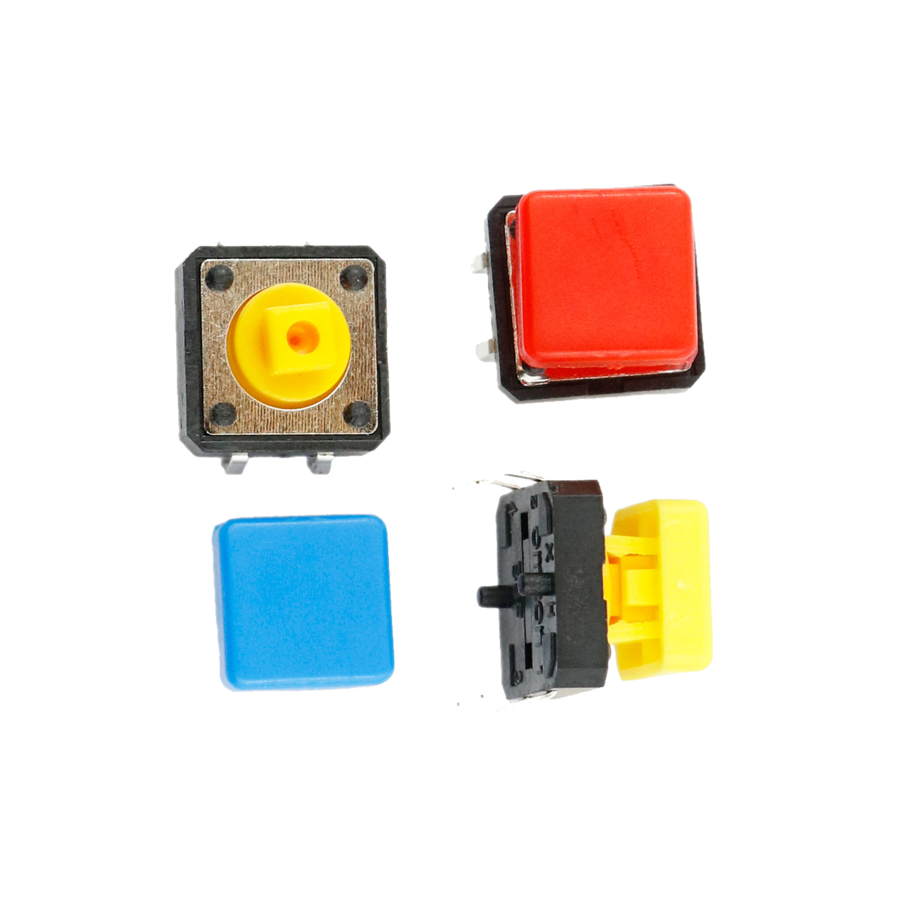

# Taster/Knopf



## Beschreibung
Taster oder auch Knöpfe sind eine sehr einfache Eingabemöglichkeit für Elektronik-Projekte und können frei nach eigenen Vorstellungen eingesetzt werden. Mit einem zurückfedernden Schaltmechanismus stellen sie einen elektrischen Kontakt zwischen den Anschlusspins her, solange der Taster gedrückt ist.  Die Taster müssen allerdings an entsprechende Verlängerungskabel gelötet oder über Breadboards mit dem Mikrocontroller verbunden werden.

Um den Schaltvorgang mit einem Mikrocontroller zu erfassen, wird ein digitaler Pin des Controllers mit dem Taster verbunden. Der andere Anschluss des Tasters wird mit Masse verbunden. Sobald der Taster betätigt wird, wird damit ein digitaler Anschlusspin des Mikrocontrollers auf Masse gelegt, was der Controller erfasst.

Der Schalter lässt sich an einen Arduino oder Raspberry Pi anschließen. Er benötigt dafür nur einen digitalen Pin.

Alle weiteren Hintergrundinformationen sowie ein Beispielaufbau und alle notwendigen Programmbibliotheken sind auf der Produktseite zusammengefasst. Zusätzlich findet man über alle gängigen Suchmaschinen meist nur mit der Eingabe der genauen Komponenten-Bezeichnungen.


## Beispiel

schau dir das Minimal-Beispiel an:

```c++:public/mks/parts/mks-generic-Taster/examples/Taster_minimal/Taster_minimal.ino
// look in the linked file.
```

<!-- infolist -->


## Wichtige Links für die ersten Schritte:

- [Einführung: Videotutorial von _Make Your School_](https://www.youtube.com/watch?v=ITsk6dPSsqA)
- [Adafruit Button-Sortiment](https://www.adafruit.com/product/1010)

## Projektbeispiele:

- [Funduino - Taster Tutorial](https://funduino.de/nr-5-taster-am-arduino)

##Weiterführende Hintergrundinformationen:

- [GPIO - Wikipedia Artikel](https://de.wikipedia.org/wiki/Allzweckeingabe/-ausgabe)
- [Steckplatine](https://de.wikipedia.org/wiki/Steckplatine) [(Breadboard)](https://de.wikipedia.org/wiki/Steckplatine) [- Wikipedia Artikel](https://de.wikipedia.org/wiki/Steckplatine)

