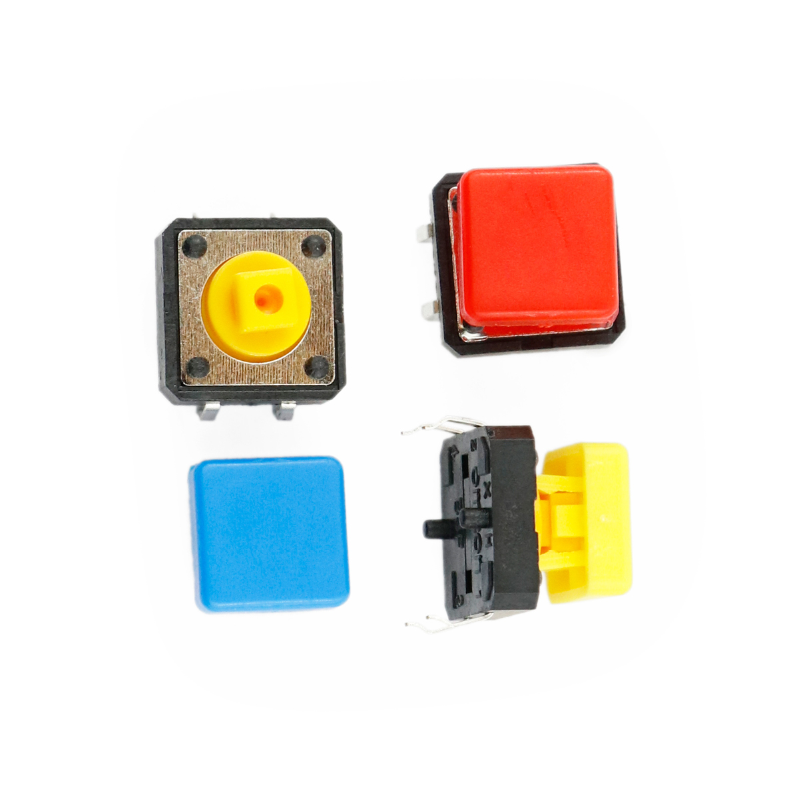

---
title: "Taster/Knopf"
date: "2018-10-01T14:48:30.000Z"
tags: 
  - "sensor"
coverImage: "59_taster_knopf.jpg"
material_number: "59"
material_type: "sensor"
manufacture: "Generic"
repo_name: "mks-generic-Taster"
repo_prefix: "mks"
repo_manufacture: "generic"
repo_part: "Taster"
clone_url: "https://github.com/Make-Your-School/mks-generic-Taster.git"
embedded_example_file: "examples/Taster_minimal/Taster_minimal.ino"
---

# Taster/Knopf

## Beschreibung
Taster oder auch Knöpfe sind eine sehr einfache Eingabemöglichkeit für Elektronik-Projekte und können frei nach eigenen Vorstellungen eingesetzt werden. Mit einem zurückfedernden Schaltmechanismus stellen sie einen elektrischen Kontakt zwischen den \[simple\_tooltip content='Die Mikrocontroller besitzen kleine metallische Kontakte, an die Komponenten, Shields oder andere Platinen angeschlossen werden können. Diese Kontakte werden Pins genannt und können oft als sogenannte GPIOs (Allzweck-Ein- und Ausgabe) eingesetzt werden. Dies bedeutet, dass diese Pins direkt über die Programmierung des Mikrocontrollers angesprochen werden können und hierbei sogar bestimmt werden kann, ob dieser Pin ein Eingang (bspw. zum Auslesen eines Sensors) oder als Ausgang (bspw. zur Steuerung eines Motors) genutzt werden kann. Praktisches vereinfachtes Beispiel: Wird am Arduino eine LED an Pin 1 angeschlossen, kann im Programm direkt der Pin 1 als „An“ oder „Aus“ definiert werden und damit die LED an- oder ausgeschaltet werden. '\]Anschlusspins\[/simple\_tooltip\] her, solange der Taster gedrückt ist.  Die Taster müssen allerdings an entsprechende Verlängerungskabel gelötet oder über Breadboards mit dem Mikrocontroller verbunden werden.

Um den Schaltvorgang mit einem Mikrocontroller zu erfassen, wird ein digitaler Pin des Controllers mit dem Taster verbunden. Der andere Anschluss des Tasters wird mit Masse verbunden. Sobald der Taster betätigt wird, wird damit ein \[simple\_tooltip content='Digital vs Analog: • Analoge Signale können beliebige, kontinuierliche Werte annehmen. Sie verändern sich stufenlos. Dadurch können theoretisch unendlich kleine Änderungen (und damit ein unendlicher Informationsinhalt) übertragen werden. Einschränkend wirkt die Genauigkeit, mit der das analoge Signal ausgelesen/erfasst wird. • Das digitale Signal nimmt nur diskrete Werte an und springt bei einer etwaigen Änderung von einem Wert zum nächsten. Es kann nur eine definierte Anzahl an Informationsinhalten übertragen werden. Vorteilhaft ist dagegen die damit verbundene Fehlerfreiheit bei minimalsten, ungewollten Schwankungen. Oftmals werden nur zwei Werte HIGH und LOW (Ein/Aus oder 1/0) übermittelt.'\]digitaler Anschlusspin\[/simple\_tooltip\] des Mikrocontrollers auf Masse gelegt, was der Controller erfasst.

Der Schalter lässt sich an einen Arduino oder Raspberry Pi anschließen. Er benötigt dafür nur einen digitalen Pin.

Alle weiteren Hintergrundinformationen sowie ein Beispielaufbau und alle notwendigen Programmbibliotheken sind auf der Produktseite zusammengefasst. Zusätzlich findet man über alle gängigen Suchmaschinen meist nur mit der Eingabe der genauen Komponenten-Bezeichnungen.

<!-- infolist -->

## Wichtige Links für die ersten Schritte:

- [Einführung: Videotutorial von _Make Your School_](https://www.youtube.com/watch?v=ITsk6dPSsqA)
- [Adafruit Button-Sortiment](https://www.adafruit.com/product/1010)

## Projektbeispiele:

- [Funduino - Taster Tutorial](https://funduino.de/nr-5-taster-am-arduino)

##Weiterführende Hintergrundinformationen:

- [GPIO - Wikipedia Artikel](https://de.wikipedia.org/wiki/Allzweckeingabe/-ausgabe)
- [Steckplatine](https://de.wikipedia.org/wiki/Steckplatine) [(Breadboard)](https://de.wikipedia.org/wiki/Steckplatine) [- Wikipedia Artikel](https://de.wikipedia.org/wiki/Steckplatine)

